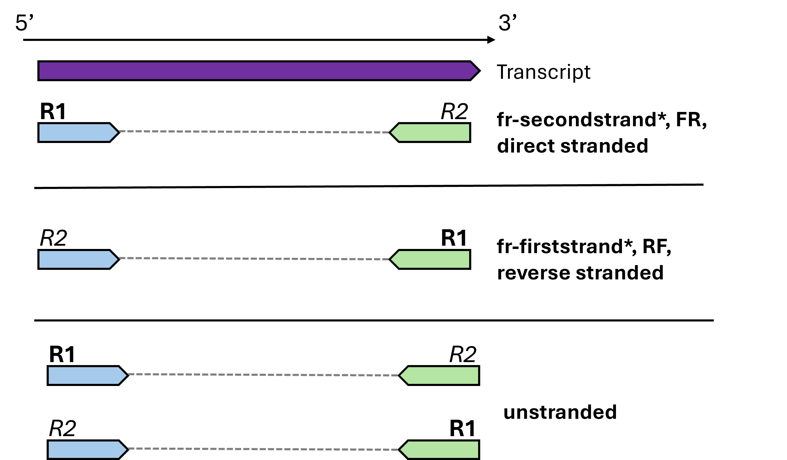

# Introduction

In a previous tutorial you worked on a **reference-guided assembly**, where sequencing reads are aligned to a known reference genome to reconstruct transcripts and identify differentially expressed genes (DEGs). In this tutorial, you will be introduced to **de novo transcriptome assembly**, or reference-free assembly, where transcripts are assembled using only the information contained in the reads themselves.

De novo assembly is useful when no reference genome is available, or when existing references are incomplete or poorly annotated. For example, if a genome has unresolved regions or assembly gaps, reference-guided methods won't be able to reconstruct transcripts in these areas.

The workflow in de novo assembly begins with the quality filtering: removing short and low-quality reads as well as removing unwanted sequences like rRNA or contaminants (i.e. pathogens of a host species). The remaining reads are then assembled into transcripts. This is similar to what you have seen for genome assembly. However, the goal here is not to build a single long assembly but to reconstruct many shorter transcripts, each representing a different gene or isoform. After you have generated the assembly, transcripts can be annotated (since we don't work with medical data, we have to annotate everything ourselves) and used to identify DEGs.

## Today's aims

In today's practical session, you will learn how to:

-   Extract information from a paper's methods section
-   Prepare raw sequencing data for de novo transcriptome assembly
-   Assemble transcriptomic data into transcripts using Trinity


::: {.callout-tip}
## Tip

The code chunks throughout this two-day tutorial are designed to lead you from quality cleaning to DEG analysis. To better understand the workflow and avoid errors, it is important to explore the outputs of each command further. 

During the tutorial, try to use simple Unix tools like `head`, `wc -l`, `grep`, `sort`, or `cut` to check file contents, count lines, and confirm that results look as expected. 

These quick checks help you catch problems early (e.g. empty files, truncated reads, mismatched sample IDs) as well as understand the output of different software tools.
:::

## Used software

Most software tools that you need to follow this tutorial are already installed for you on Crunchomics either system-wide or inside a conda/mamba environment. If you have not yet installed conda/mamba, then you can follow [these instructions](https://scienceparkstudygroup.github.io/ibed-bioinformatics-page/source/conda/conda.html) to set it up.

The tools we use in this tutorial include:

- FastQC v0.11.9
- SeqKit v2.7.0
- fastp v0.26.0
- Trinity v2.15.2 (conda)
- BUSCO v5.8.0 (conda)
- TransDecoder v5.7.1 (conda)
- HMMER v3.3.2 

**The conda environments can be activated with the following commands**:

```{bash}
# Trinity 
conda activate /zfs/omics/projects/education/BBDA_transcriptomics/denovo/envs/trinity_bbda

# TransDecoder and BUSCO
conda activate /zfs/omics/projects/education/BBDA_transcriptomics/denovo/envs/transcriptomics_bbda
```

If you want to install software yourself, you can find the commands to install your own conda environments below:

::: {.callout-caution collapse="true" appearance="simple"}
## Installation notes

```{bash}
mamba create \
    -p <your_path>/transcriptomics_bbda \
    -c bioconda -c conda-forge \
    python=3.10.15 \
    busco=5.8.0 \
    transdecoder=5.7.1 

mamba create \
    -p <your_path>/trinity_bbda \
    -c bioconda -c conda-forge \
    trinity=2.15.2
```

:::

## The data

In this tutorial, we will work with data published by @ruocco2017, who investigated how the seagrass species *Cymodocea nodosa* responds to experimental ocean acidification (OA). OA is a consequence of climate change and happens because of increasing levels of atmospheric $CO_2$ that dissolves into seawater and thereby lowers ocean pH. While some marine species are negatively affected, others may tolerate or even benefit from OA. To explore this further, the authors grew *C. nodosa* under control (400 ppm) and elevated (1200 ppm) $CO_2$ conditions to study which biological pathways are affected by OA.

For this practical we work with 6 transcriptomic samples: 3 biological replicates that were grown for 15 days under ambient $CO_2$ levels (untreated) and 3 biological replicates that were grown under increased levels of $CO_2$ (treated).

::: {.callout-note title="Question" appearance="simple"}
Start by reading the methods section [of the Ruocco et al., manuscript](https://onlinelibrary.wiley.com/doi/10.1111/mec.14204) and answer the following questions:

1.  Are the reads we work with single-end or paired-end?
2.  What is the read length?
3.  Was unstranded or stranded sequencing used? If stranded, which strand was sequenced?

Knowing these things is important, also when you work with your own data, since parameters of different tools you use depend on what type of data you work with.

🔎 **Good to Know**

In transcriptomics it is important to know which strand was sequenced as this affects downstream steps. You may encounter the following terminology when exploring the manuals of different software tools:

<center>{width="70%"}</center>

::: {.callout-tip title="Answer" collapse="true" appearance="simple"}
1.  We work with paired-end sequencing data that was generated using the Illumina HiSeq 1000 platform.
2.  The reads are 100 bp long.
3.  We work with reverse stranded sequencing data. Two parts of the methods section tell you more about this:
    -   The authors used the Illumina TruSeq® Stranded mRNA protocol to prepare the sequencing libraries. If you search for more information about this kit online, you will also find the direction of the strand. According to [Illumina documentation]((https://knowledge.illumina.com/library-preparation/rna-library-prep/library-preparation-rna-library-prep-reference_material-list/000002238)), Read 1 maps to the antisense strand, and Read 2 to the sense strand, meaning a reverse stranded protocol was used.
    -   If you look into the assembly settings you will find that Trinity was run with the argument `SS_lib_type RF`, which also confirms that we work with reverse stranded data.
:::
:::

**Log onto the Crunchomics headnode to follow the next steps in this tutorial!**

To reduce compute time, we won't be working with the full dataset but with a sub-sampled dataset that was already prepared for you (\~10 million reads/sample). The data are available here:  

`/zfs/omics/projects/education/BBDA_transcriptomics/denovo/data`  

::: {.callout-note title="Question" appearance="simple"}
Before you start working with this data, investigate where the authors made the dataset available. Sometimes, this will take a bit of detective work. The questions below are aimed at familiarizing you with finding public data as well as the metadata that is needed to generate a mapping file, i.e. a file that links the sample IDs with other information such as the used $CO_2$ concentration.

1.  Check the paper's data accessibility section and identify where the authors deposited their sequencing data.
2.  Go to the data archive that is described in the paper. Is it immediately clear where the raw data, i.e. the FASTQ files, are? How easy is it to retrieve usable sequencing data?
3.  To dig deeper click `View: EMBL` on the page for sample [HADH01000001](https://www.ebi.ac.uk/ena/browser/view/HADH01000001) and find the Project ID. Use this ID to search in the ENA repository for the sequence reads. How many samples did the authors sequence in total?
4.  Based on the [sample information on ENA](https://www.ebi.ac.uk/ena/browser/view/PRJEB12372) generate a mapping file, i.e. a file that links the sample IDs with more descriptive information. Specifically, do the following:
    -   Use the Run Accessions, i.e. ERR1211089, from `/zfs/omics/projects/education/BBDA_transcriptomics/denovo/data` and find the corresponding treatment by exploring the information on ENA that is stored under the Sample Accession. 
    -   Generate a metadata file called `metadata.txt` in your personal folder (`~/personal`). Add two tab-separated headers: runID and treatment. Then add 6 rows with the sample information (3 samples from treated and 3 samples from untreated conditions). 
    - Hint: To have a consistent metadata table, use the term "untreated" for samples from 400 ppm and "treated" for samples grown under 1200 ppm.
    - Hint: If you completely get stuck you can also use the file available in `/zfs/omics/projects/education/BBDA_transcriptomics/denovo/`.

::: {.callout-tip title="Code example" collapse="true" appearance="simple"}
1.  The data was deposited in the [European Nucleotide Archive (ENA)](http://www.ebi.ac.uk/ena) under the accessions HADH01000001-HADH01059478.
2.  On the linked page we can find the assembly as a FASTA file that can be accessed by clicking `SET FASTA`, for example on the page for [HADH01000001](https://www.ebi.ac.uk/ena/browser/view/HADH01000001). However, finding the raw FASTQ data is a bit more difficult. For example, if we click on `Sequence versions: View` we see that we can not actually download any raw data.
3.  The Project ID is PRJEB12372. We can use this ID to search in ENA using the general search field to find the actual [raw data](https://www.ebi.ac.uk/ena/browser/view/PRJEB12372). We see that there are a total of 9 samples sequenced, 6 of which we are analysing today. The other 3 samples are control samples, i.e. samples that were collected before the actual experiment.
4.  Hint: When you are on the Sample Accession website, click `show more` to get all information. Your final list should look like this:

| runID      | treatment |
|------------|-----------|
| ERR1211089 | untreated |
| ERR1211091 | untreated |
| ERR1211093 | untreated |
| ERR1211088 | treated   |
| ERR1211090 | treated   |
| ERR1211092 | treated   |
:::
:::

## Data preparation

### Organize your project

Before you start generating output, it helps to set up a clear folder structure for your project. Keeping raw data references, scripts, log files, and results in separate, clearly named folders makes it much easier to find things again later, and to know what is safe to delete.

All following code sections will have a similar structure and consist of comments and hints that tell you what kind of command you should write. Replace the `...` with your own code. For some parts, you will already get the full command.

```{bash}
# Generate a project directory in ~/personal and call it `denovo`, then move into it
...

# Move the metadata.txt file you generated earlier into a new `files` folder
# Hint: `files` is a good place to collect small text files you will generate
# throughout this tutorial, such as metadata and sample mapping files
...

# Make folders to store the FastQC/seqkit results, separately for the raw
# reads and for the reads after quality cleaning
...

# Make folders to store your SLURM (sbatch) scripts and their log files
...
```

::: {.callout-caution title="Code example" collapse="true" appearance="simple"}
```{bash}
# Generate a project directory in ~/personal and call it `denovo`, then move into it
mkdir -p ~/personal/denovo
cd ~/personal/denovo

# Move the metadata.txt file you generated earlier into a new `files` folder
mkdir files
mv ~/personal/metadata.txt files/

# Make folders to store the FastQC/seqkit results, separately for the raw
# reads and for the reads after quality cleaning
mkdir -p quality/raw quality/cleaned

# Make folders to store your SLURM (sbatch) scripts and their log files
mkdir scripts logs
```
:::

::: {.callout-tip}
## Tip

A small amount of folder structure goes a long way. Keeping small text files (like `metadata.txt` and the sample mapping files you will generate later) in `files/`, your sbatch scripts in `scripts/`, their output in `logs/`, and separating raw from processed data, makes it much easier to find things back and avoid accidentally overwriting or deleting the wrong output as your project grows.
:::

### Assess the sequence quality

You should already be familiar with FastQC [@fastqc2015], a tool that lets you assess the quality of sequence data. As you have done in a previous tutorial, you will use FastQC to perform a quality assessment of the raw reads. Additionally, you will use [SeqKit stats](https://scienceparkstudygroup.github.io/ibed-bioinformatics-page/source/core_tools/seqkit.html) to generate a summary table to count the total number of reads you're working with [@Shen2016].

```{bash}
# Set an environment variable to the folder with the raw data
# Note: It is recommended to store all custom paths as variables at the top of your code,
# then you only have one location where you have to change the code later
DATA="/zfs/omics/projects/education/BBDA_transcriptomics/denovo/data"

# Run FastQC
# Estimated run time: < 5 min
# Hints: - Run FastQC on all files at once
#        - Ensure that the output is written to the quality/raw folder you created earlier
#       - Submit this on the compute node with srun with these settings:
#         `--cpus-per-task 4` and `--mem=20G`
#       - Make use of the DATA variable to access the raw fastq.gz files
#       - Make sure that the threads fastqc uses are the same as the ones requested with --cpus-per-task 4
srun --cpus-per-task 4 --mem=20G ...

# Run seqkit
# Estimated run time: < 5 min
# `seqkit stats` can be used to generate summary stats for multiple fastq files in a single text file
# Hints:   - Use srun with 4 CPUs and 20G of memory, 
#          - Generate a single output file that contains all stats 
#            for all 12 fastq files in tabular format
#          - Store the output file in the quality/raw folder
#          - Make use of the DATA variable
srun ...

# Count the total number of sequences across all FASTQ files
# The command below does the following:
# Step 1: Uses the seqkit stats output that has the nr. of reads in column 4
# Step 2: Uses awk to:
#         - skip the header row (NR>1)
#         - sum the values from column 4 (sum+=$4)
# Step 3: Prints the total number of reads at the end
# Hint: replace 'quality/raw/seqkit.tsv' with the path to your own stats file
awk 'NR>1 {sum+=$4} END {print sum}' quality/raw/seqkit.tsv

# View the FastQC HTML files
# Hints:    -  You can open HTML files on the server via the RStudio file interface 
#              or download the files to your computer with scp
#           - When using scp run the scp command from your local computer, not the HPC
#             by using the following format `scp file destination`
...
```

::: {.callout-caution title="Code example" collapse="true" appearance="simple"}
```{bash}
# Set an environment variable to the folder with the raw data
DATA="/zfs/omics/projects/education/BBDA_transcriptomics/denovo/data"

# Run FastQC
srun --cpus-per-task 4 --mem=20G fastqc ${DATA}/*fastq.gz -o quality/raw --threads 4

# Run seqkit
srun --cpus-per-task 4 --mem=20G seqkit stats ${DATA}/*fastq.gz -aTo quality/raw/seqkit.tsv --threads 4

# Answer: We work with 60,000,000 reads
awk 'NR>1 {sum+=$4} END {print sum}' quality/raw/seqkit.tsv

# Download the FastQC HTML files
scp user@omics-h0.science.uva.nl:/home/user/personal/denovo/quality/raw/*html quality/raw
```
:::

::: {.callout-note title="Question" appearance="simple"}
Have a look at some of the HTML files that were generated by FastQC. If you are unsure what each plot is showing then you can find a description of each plot [here](https://www.bioinformatics.babraham.ac.uk/projects/fastqc/Help/3%20Analysis%20Modules/). Do you see anything unusual that would suggest that we should do some quality cleaning?

::: {.callout-tip title="Answer" collapse="true" appearance="simple"}
There is nothing unusual. The sequence quality is good over the whole length of the sequence with a small drop in quality at the end of the sequence. However, that is nothing unusual for Illumina data. We see a very small fraction of Illumina adapter sequence, which we might want to clean.
:::
:::

::: {.callout-tip title="Good to Know: Removing rRNA and contaminant sequences" collapse="false" appearance="simple"}
You might wonder why we don't remove ribosomal RNA (rRNA) or other contaminating sequences before assembly, even though the introduction on this page mentions it as part of a typical de novo workflow.

For this dataset, we checked the rRNA content beforehand with a dedicated rRNA-detection tool, and it came back low (roughly 1-4.5% of reads per sample). Because of this, and to keep the tutorial close to the trimming strategy used in the original paper, we skip an explicit rRNA-removal step here.

**In a real project**, especially for data that wasn't prepared with polyA selection or a similar mRNA-enrichment step, rRNA content can be much higher and is worth checking. Tools like SortMeRNA or RiboDetector can screen your reads for rRNA and remove matching ones before you spend time and compute assembling them. The same applies to other unwanted sequences, such as reads from a host species or another contaminating organism: check for these and remove them before assembly, for example using tools like kraken2. For this data its not needed and would get quite time-consuming, which is why this tutorial doesn't walk through it.
:::

### Quality cleaning

Although our FastQC report showed good quality, this is uncommon in real datasets. To reproduce the papers workflow, we will now clean the sequences using `fastp` [@Chen2018]. To learn about the different options of this tool, you can go [here](https://github.com/OpenGene/fastp).

For this workflow we'll mimic the trimming strategy from the original paper, which used Trimmomatic with these settings: `SLIDINGWINDOW:3:25 MINLEN:50`. SLIDINGWINDOW is a quality trimming step that looks at a window of 3 bases along the read. If the average quality of the bases in that window drops below 25 then the read will be cut at this point. MINLEN is a length filter that discards any reads shorter than 50 base pairs. 

The reason why we will use fastp instead of Trimmomatic is because it runs faster. In fastp you can use the following settings to mimic the described trimmomatic settings:

-   `--cut_window_size 3`
-   `--cut_mean_quality 25`
-   `--length_required 50`
-   `--cut_right`

Since fastp will run for a bit longer and we want to run it on multiple samples, we will now write our first SLURM job script. For this, we could use a [for-loop](https://scienceparkstudygroup.github.io/ibed-bioinformatics-page/source/core_tools/bash-for-loops.html), which would run all 6 fastp steps one after the other. You can also use [SLURM arrays](https://blog.ronin.cloud/slurm-job-arrays/) to parallelize these steps and, for example, run 2 fastp steps at the same time. Because you’ve likely already worked with for-loops, the code template below shows an example that makes use of a SLURM array instead.

After the quality cleaning is done, we will repeat the `fastqc` and `seqkit stats` analyses on the quality-cleaned reads in order to see if the quality has improved.

```{bash}
# Make a folder to store the fastp output
...

# Run fastp on all 6 samples using a SLURM array
# Example script to store in `scripts/fastp.sh`:
'''
#!/bin/bash
#SBATCH --job-name=fastp
#SBATCH --array=1-6%2                   # Run 6 jobs, 2 at a time
#SBATCH --output=logs/fastp_%A_%a.out   # %A= job id, %a= array index
#SBATCH --error=logs/fastp_%A_%a.err
#SBATCH --cpus-per-task=4
#SBATCH --mem=20G
#SBATCH --time=2:00:00

# Define the path to the raw data
DATA="/zfs/omics/projects/education/BBDA_transcriptomics/denovo/data/"

# Extract the sample ID from files/metadata.txt and use it for the array
# - cut: takes the first column in files/metadata.txt (sample IDs)
# - sed "1d": removes the header
# - sed -n "${SLURM_ARRAY_TASK_ID}p": picks the line corresponding to the array index
SAMPLE=$(cut -f1 files/metadata.txt | sed "1d" | sed -n "${SLURM_ARRAY_TASK_ID}p")

# Run fastp
# Estimated run time: < 5 min
# Hints:    - Make use of the DATA and SAMPLE variables to build the names
                for the input and output files
#           - Trim reads where quality drops below 25 in a 3 bp window
#           - Discard reads shorter than 50 bp
#           - Save the paired outputs, _1 and _2, in two separate files
#           - Set the threads in accordance with the SLURM allocations
fastp ...
'''

# Submit the job script
...

# Run FastQC on the quality-cleaned paired reads with the same srun settings as before
srun ...

# Run seqkit on the quality-cleaned paired reads with the same srun settings as before
srun ...

# Check total number of reads remaining after the quality cleaning
...
```

::: {.callout-caution title="Code example" collapse="true" appearance="simple"}

```{bash}
# Make a folder to store the fastp output
mkdir fastp

# Example code to run fastp with an array
'''
#!/bin/bash
#SBATCH --job-name=fastp
#SBATCH --output=logs/fastp_%A_%a.out
#SBATCH --error=logs/fastp_%A_%a.err
#SBATCH --array=1-6%2
#SBATCH --cpus-per-task=4
#SBATCH --mem=20G
#SBATCH --time=2:00:00

# Define the DATA path
DATA="/zfs/omics/projects/education/BBDA_transcriptomics/denovo/data/"

# Extract sampleID from our mapping file
SAMPLE=$(cut -f1 files/metadata.txt | sed "1d" | sed -n "${SLURM_ARRAY_TASK_ID}p")

# Run fastp in an array
fastp -i ${DATA}/${SAMPLE}_1.fastq.gz \
    -I ${DATA}/${SAMPLE}_2.fastq.gz \
    -o fastp/${SAMPLE}_1_paired.fastq.gz \
    -O fastp/${SAMPLE}_2_paired.fastq.gz \
    --cut_window_size 3 --cut_mean_quality 25 --length_required 50 --cut_right \
    --thread 4 
'''

# Submit the job 
sbatch scripts/fastp.sh

# Run FastQC
srun --cpus-per-task=4 --mem=20G fastqc fastp/*_paired.fastq.gz -o quality/cleaned --threads 4

# Run SeqKit
srun --cpus-per-task=4 --mem=20G seqkit stats fastp/*_paired.fastq.gz -aTo quality/cleaned/seqkit.tsv --threads 4

# Check total number of reads remaining
# We now work with 58,411,986 reads
awk 'NR>1 {sum+=$4} END {print sum}' quality/cleaned/seqkit.tsv
```
:::

::: {.callout-note title="Question" appearance="simple"}
Have a look at some of the HTML files generated by FastQC: did the statistics improve? Additionally, answer what percentage of reads were kept after the cleaning process?

::: {.callout-tip title="Answer" collapse="true" appearance="simple"}
The cleaning worked. The quality is slightly better and the adapter sequences are gone. We still work with \~97% of the data, which is in a very good range.
:::
:::

## Assembly

There is a range of different tools for de novo assembly. In this tutorial, we will use Trinity [@Grabherr2011], an open-source tool that comes with a long list of associated tools for downstream analyses. For detailed usage information, you can visit [the tool's wiki](https://github.com/trinityrnaseq/trinityrnaseq/wiki).

```{bash}
# Create a samples mapping file suited for Trinity
# Step 1: Check the Trinity documentation for the expected format:
#         sample_name   replicate_name   read1_path   read2_path
# Step 2: Use awk to generate this mapping automatically from files/metadata.txt
#         - NR>1       : skip the header row
#         - OFS="\t"   : output columns separated by tabs
#         - printf     : builds the content of each column with
#                       sample name, replicate name, path to read1, path to read2
#         - count[$2]  : keep track of replicate numbers per sample
# **Important**:    Adjust the path in printf if your fastp folder has a different name
#                   You find the term `fastp` twice in the line with printf 
#                   replace it with the folder name that you have used
awk 'BEGIN{OFS="\t"} 
        NR>1 {
            printf "%s\t%s_rep%d\tfastp/%s_1_paired.fastq.gz\tfastp/%s_2_paired.fastq.gz\n", \
            $2, $2, ++count[$2], $1, $1
        }' files/metadata.txt > files/trinity_mapping.txt

# Write and run a sbatch script to execute Trinity 
# Hints: - Ensure that you activate the `trinity_bbda` conda environment in your script
#        - `source ~/.bashrc` is needed to activate conda inside a compute node
#        - In the SLURM directives ask for 10 CPUs, 50G and 24 hours of run time
#        - Ensure that you account for the read strand
#        - use the argument `--samples_file` to work with all 6 samples at once
#        - use the settings: --max_memory 50G --inchworm_cpu 10 --CPU 10 
#                            --min_kmer_cov 2 --full_cleanup --output trinity/trinity
'''
#!/bin/bash
#SBATCH --job-name=trinity
#SBATCH --output=logs/trinity_%j.out
#SBATCH --error=logs/trinity_%j.err
#SBATCH --cpus-per-task=10
#SBATCH --mem=50G
#SBATCH --time=24:00:00

# Activate conda environment
source ~/.bashrc
conda activate /zfs/omics/projects/education/BBDA_transcriptomics/denovo/envs/trinity_bbda

# Run trinity
Trinity ...
'''

# Submit the job 
...
```

::: {.callout-caution title="Code example" collapse="true" appearance="simple"}

```{bash}
# Create a samples mapping file for Trinity
awk 'BEGIN{OFS="\t"} 
        NR>1 {
            printf "%s\t%s_rep%d\tfastp/%s_1_paired.fastq.gz\tfastp/%s_2_paired.fastq.gz\n", \
            $2, $2, ++count[$2], $1, $1
        }' files/metadata.txt > files/trinity_mapping.txt

# Prepare the SLURM script scripts/trinity.sh:
'''
#!/bin/bash
#SBATCH --job-name=trinity
#SBATCH --output=logs/trinity_%j.out
#SBATCH --error=logs/trinity_%j.err
#SBATCH --cpus-per-task=10
#SBATCH --mem=50G
#SBATCH --time=24:00:00

# activate conda environment
source ~/.bashrc
conda activate /zfs/omics/projects/education/BBDA_transcriptomics/denovo/envs/trinity_bbda

# Run trinity
Trinity --seqType fq --max_memory 50G --samples_file files/trinity_mapping.txt \
    --SS_lib_type RF  --inchworm_cpu 10 --CPU 10 \
    --min_kmer_cov 2 --full_cleanup \
    --output trinity/trinity
'''

# Submit the job
sbatch scripts/trinity.sh
```
:::

::: {.callout-tip title="Good to Know" collapse="true" appearance="simple"}
You might notice that the Trinity command above leaves out a few settings the original paper used: `SS_lib_type RF –normalize_reads –inchworm_cpu 24 –bflyHeapSpaceInit 24G –bflyHeapSpaceMax 240G –CPU 24 –jaccard_clip –min_kmer_cov 2`. Two of these are worth knowing about:

-   **`--normalize_reads` is no longer something you need to set.** Trinity has performed in silico read normalization by default since 2016, well before the version used in this course (v2.15.2). The flag is still accepted for backwards compatibility, but it does nothing; normalization only turns off if you explicitly add `--no_normalize_reads`. So even though our command doesn't mention it, normalization is still happening.
-   **`--jaccard_clip` was deliberately left out.** This option helps resolve fused transcripts in densely packed genomes, but it adds extra runtime and memory. To keep the assembly step manageable within a practical session, we skip it here.

The lower `--inchworm_cpu`/`--CPU` values compared to the paper are simply scaled down to match our smaller, subsampled dataset and the compute resources allocated for this course.
:::

🔎 **Good to Know**

Trinity is not the only transcriptome assembly tool out there. While it is out of the scope of this tutorial to compare different assembly tools, you might also read about SOAPdenovo-Trans [@Xie2014], IDBA-Tran [@Peng2013], rnaSPADES [@Bushmanova2019], and other assembly tools. Choosing the right assembler and assembly settings can be a difficult task. How an assembler performs will differ a lot for different datasets, and there is no good way to predict what the best assembler for your data is [@Hölzer2019]. Therefore, it is often recommended to compare different assemblers with multiple kmer lengths.


## References

::: {#refs}
:::
